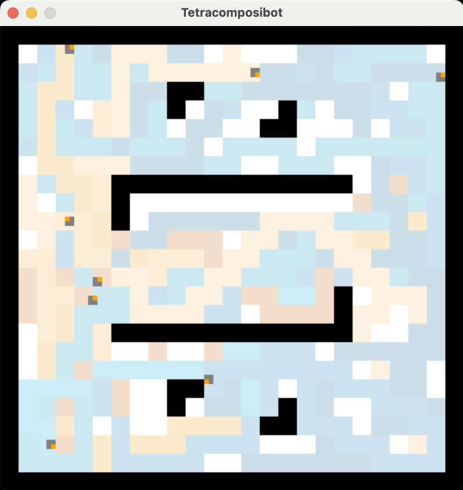

# =-= TETRACOMPOSIBOT =-=

contact  : nicolas.bredeche at sorbonne-universite dot fr

initiated: 2025-03-25

revised  : 2025-03-30

* A simple simulator for playing with one... to many robots
* Un simulateur très simple pour jouer avec un ou plusieurs robots

_"With the Tetracomposibot it has now become possible to play and compose REAL simple robot demo"_

Demo: _python tetracomposibot.py_

# Pré-requis

* Python 3.x
* PyGame
* Numba (si absent, utilisez _tetracomposibot_noOpt.py_

# LANCER LE SIMULATEUR

Pour lancer une expérience:
- méthode 1: en ligne de commande, _python tetracomposibot.py_. Utilise config.py comme fichier par défaut.
- méthode 2: en ligne de commande, _python tetracomposibot.py <fichier config sans extension .py>_. Par exemple: _python tetracomposibot.py config_Paintwars_. Vous pouvez créer/modifier votre fichier de configuration comme il vous plaira.
- méthode 3: en ligne de commande, avec des paramètres. Cf. _python tetracomposibot.py -h_. Par exemple: _python tetracomposibot.py config_Paintwars 1 False 0_

## INFOS CODE ##

Fichier à modifier:
- Le comportement d'un type de robot est défini dans un fichier dédié, par exemple robot_wanderer.py
- Le dispositif expérimental (choix de l'arène, rendu graphique, nombre d'itérations, etc.) sont définis dans un fichier Python de configuration, par exemple config.py. Ce fichier contient aussi une fonction permettant d'initialiser la position des robots au début de la simulation

Fichier à ne pas modifier (cas général):
- le fichier arenas.py contient la définition de toutes les arènes disponibles (100x100 pixels, divisés en 25x25 cases)
- le fichier tetracomposibot.py contient le simulateur

# MODIFIER LA CONFIGURATION

Ce fichier permet de fixer les paramètres généraux de la situation. Certains peuvent être écrasés en ligne de commande (numéro de l'arène, position de départ, vitesse de rendu, nombre maximum d'itérations). Les autres paramètres permettent de choisir quels sont les messages à afficher dans le terminal.

Ce fichier contient aussi une fonction permettant de placer les robots avant que la simulation ne commence.

Le simulateur traite des coordonnées continues pour chaque robot, dans les limites des dimensions de l'arène. Le simulateur utiliser une orientation absolue du robot dans l'arène, codée en degré (ex.:[0...360[ ou [-180,+180[)

# CREER UN NOUVEAU PROJET

1. créer un fichier configuration (cf. config.py pour un exemple)
2. créer un fichier robot (cf. robot_wanderer.py pour un exemple)
3. lancer la simulation en donnant le fichier config en paramètre (sans l'extension .py): python tetracomposibot.py ma_config

cf. "python tetracomposibot.py -h" pour voir quels sont les paramètres que l'on peut passer en ligne de commande.

=-=-=-=

## INFOS TECHNIQUES##

# ROBOT

un robot est représenté par un carré de 2x2, avec un point donnant la direction. En pratique la localisation et l'orientation du robot existent dans un domaine continu (x et y \in R, \theta \in [0.0,360.0[.

La fonction step(.) est appelé à chaque pas du simulateur (env. 60x par seconde si display_mode=0). La dernière valeur de translation et rotation est prise en compte. Les senseurs sont mis à jour pour chaque appel.

# EFFECTEURS

Un robot est controllable par sa vitesse de translation et sa vitesse de rotation.

translation: entre -1.0 (aller en arrière) et +1.0 (aller en avant). 0 pour un robot immobile
rotation: entre -1.0 et +1.0. 

Il s'agit de valeur normalisée. En particulier, la rotation maximale par pas de temps est limité en degrés (ici: 3° max.) 

# SENSEURS

Un robot dispose de 8 senseurs répartis autour de lui (écart de 45° entre chaque senseur).

Numérotation des senseurs dans le sens inverse des aiguilles d'une montre. Valeur 0 pour le senseur orienté vers l'avant du robot. Il est possible d'obtenir 3 types d'information des senseurs, chacune étant stockées dans une liste dédiée.

sensors : sensors (distance, max is 1.0)
sensor_view : type (if any) of sensed obstacle (0:empty, 1:wall, 2:robot)
sensor_robot : robot's team (if relevant -- otherwise: "n/a")

Les variables suivantes sont pré-définies pour permettre une utilisation plus intuitive:

sensor_front = 0
sensor_front_left = 1
sensor_left = 2
sensor_rear_left = 3
sensor_rear = 4
sensor_rear_right = 5
sensor_right = 6
sensor_front_right = 7
